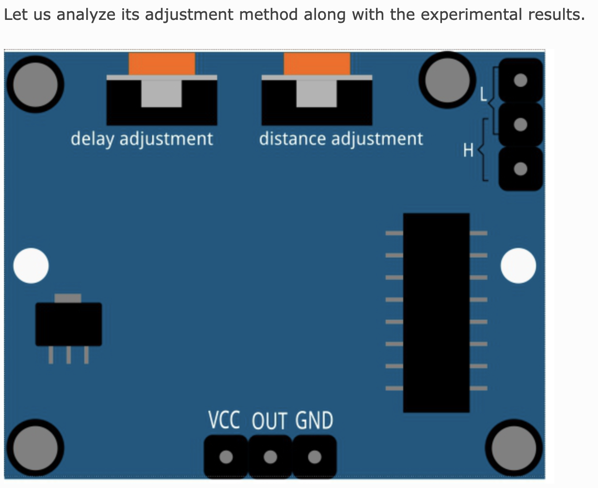

# 2.10 Detect Human Movement Notes:
- Passive infrared sensor (PIR sensor) is a common sensor that can measure infrared (IR) light emitted by objects in its field of view. Simply put, it will receive infrared radiation emitted from the body, thereby detecting the movement of people and other animals. More specifically, it tells the main control board that someone has entered your room.

1. Trigger Mode
    Let’s take a look at the pins with jumper cap at the corner. It allows PIR to enter Repeatable trigger mode or Non-repeatable trigger mode

    At present, our jumper cap connects the middle Pin and L Pin, which makes the PIR in non-repeatable trigger mode. In this mode, when the PIR detects the movement of the organism, it will send a high-level signal for about 2.8 seconds to the main control board. We can see in the printed data that the duration of work will always be around 2800ms.

    Next, we modify the position of the lower jumper cap and connect it to the middle Pin and H Pin to make the PIR in repeatable trigger mode. In this mode, when the PIR detects the movement of the organism (note that it is movement, not static in front of the sensor), as long as the organism keeps moving within the detection range, the PIR will continue to send a high-level signal to the main control board. We can see in the printed data that the duration of work is an uncertain value.

2. Delay Adjustment
    The potentiometer on the left is used to adjust the interval between two jobs.

    At present, we screw it counterclockwise to the end, which makes the PIR need to enter a sleep time of about 5 seconds after finishing sending the high level work. During this time, the PIR will no longer detect the infrared radiation in the target area. We can see in the printed data that the dormancy duration is always no less than 5000ms.

    If we turn the potentiometer clockwise, the sleep time will also increase. When it is turned clockwise to the end, the sleep time will be as high as 300s.

3. Distance Adjustment
    The centered potentiometer is used to adjust the sensing distance range of the PIR.

    Turn the knob of the distance adjustment potentiometer clockwise to increase the sensing distance range, and the maximum sensing distance range is about 0-7 meters. If it rotates counterclockwise, the sensing distance range is reduced, and the minimum sensing distance range is about 0-3 meters.